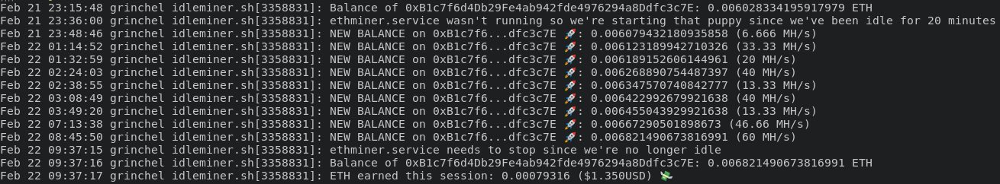

# idleminer

Mine crypto while your computer is idle. :pick:

This might or might not be profitable or a good idea for you. It might make
sense if you have a negative power bill from solar and would like a better
return on that power generation than the pennies-on-the-dollar typically
offered by power companies, for example (hmmm, not specific at all, is
it?).

Only `ethminer` through [flexpool](https://flexpool.io/) is supported at
the moment.

This is really just a collection of scripts and systemd (user) service
files. It starts and stops mining automatically, using `xprintidle` to
determine idleness.

## Installation

Install the prerequisites with your system package manager:

  - `xprintidle`
  - `units`
  - `jq`

Then copy the config and systemd units into their appropriate
directories. We use "user" service files since `xprintidle` doesn't work as
root (at least not without X11 authentication shenanigans).

    cp -v idleminer-environment ~/.config
    mkdir -pv ~/.config/systemd/user
    ln -sv $(realpath ethminer.service) ~/.config/systemd/user
    ln -sv $(realpath idleminer.service) ~/.config/systemd/user
    ln -sv $(realpath idleminer-starter.desktop) ~/.config/autostart/
    ln -sv $(realpath idleminer.sh) ~/bin/
    ln -sv $(realpath start_ethminer.sh) ~/bin/

then update `~/.config/idleminer-environment` with your miner address, idle
threshold, etc.

Reboot (or reload the `systemctl` daemon and
logout/login). `idleminer.service` will be started automatically when you
login to your desktop. If you'd rather start it manually each time just
remove `~/.config/autostart/idleminer-starter.desktop` and run `systemctl
--user start idleminer.service`.

Now when your computer is idle (as per `xprintidle`) for longer than the
period specified in your `idleminer-environment` the `ethminer.service`
will be kicked off and start mining. When `xprintidle` detects user
activity again `ethminer.service` will be stopped.

You can monitor the progress of `idleminer.service` and `ethminer.service`
with:

    journalctl --user -xf -u idleminer.service

and

    journalctl --user -xf -u ethminer.service

## Limitations

Innumerable.
